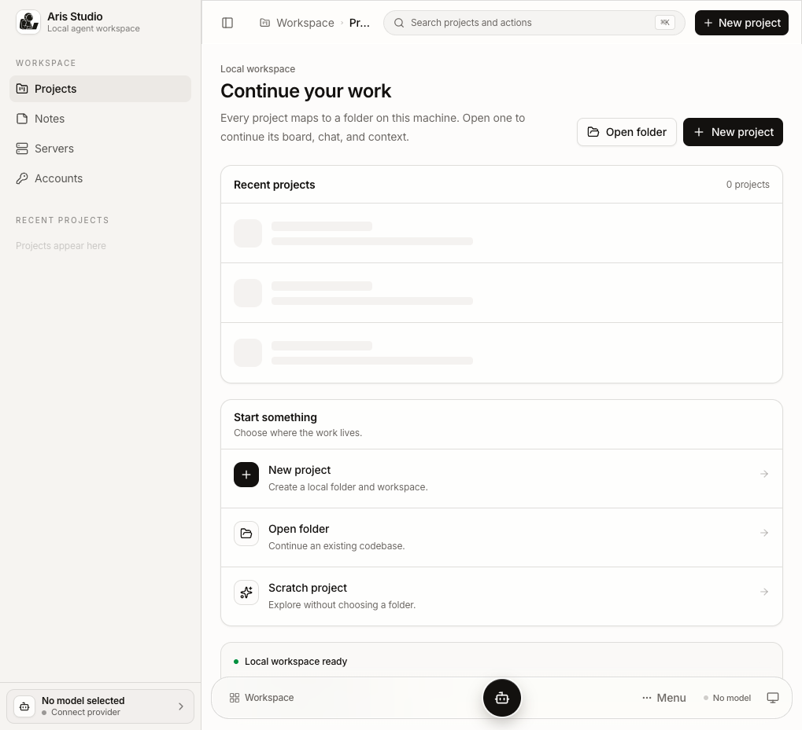

<p align="center">
  
</p>

<h1 align="center">Aris (studio) as your Agent</h1>

<p align="center">
  Local-first agent workspace — board + chat, on your machine.<br/>
  <strong>Software never finishes.</strong> Continue projects session after session.
</p>

<p align="center">
  <a href="./docs/PRD.md">PRD</a> ·
  <a href="./docs/architecture.md">Architecture</a> ·
  <a href="./docs/progress.md">Progress</a> ·
  <a href="./docs/presentations/aris-architecture/">Architecture deck</a>
</p>

---



**Aris Studio** is a senior-dev workflow you can see and steer: a kanban that *runs* research → plan → build → review, plus immediate chat. One project = one folder. Secrets stay on the node.

| | |
|---|---|
| **Full harness** | [Cursor SDK](https://cursor.com/docs) — local tools, MCP, Composer, resume |
| **Lite harness** | [OpenRouter](https://openrouter.ai) — chat/stream for model choice & cost ([ADR 014](./docs/decisions/014-multi-harness-providers.md)) |
| **UI** | TanStack Start + shadcn · macOS-style glass workflow rail |
| **Data** | `~/.aris/` · `~/aris-workspace/` · sidecar `.aris-workspace/` · secrets `~/aris-secrets/` |

## Quick start

```bash
pnpm install
cp .env.example .env   # optional: CURSOR_API_KEY and/or OPENROUTER_API_KEY
pnpm dev               # → http://localhost:3000
```

1. Open **Studio** → [`/studio`](http://localhost:3000/studio)
2. Add a **Cursor** or **OpenRouter** key under **Accounts**
3. Create or open a project folder → chat or run the board

## Docs

| Doc | Purpose |
|-----|---------|
| [docs/README.md](./docs/README.md) | Docs index |
| [docs/PRD.md](./docs/PRD.md) | Product requirements |
| [docs/architecture.md](./docs/architecture.md) | Monorepo seams, agent flow, storage |
| [docs/progress.md](./docs/progress.md) | Milestone tracker |
| [docs/task-list.md](./docs/task-list.md) | Implementation checklist |
| [docs/decisions/](./docs/decisions/) | ADRs (Master/Child, Zero Trust, multi-harness, …) |
| [docs/presentations/aris-architecture/](./docs/presentations/aris-architecture/) | Interactive HTML architecture deck |

## Monorepo

```
docs/         PRD, progress, architecture, ADRs, presentation
packages/     @aris/core, agent, workspace, projects, notes, server, …
apps/web      TanStack Start UI → Aris Studio
brand/        Logo assets
.cursor/      composer-rules + Aris persona / server-safety
```

## Requirements

- Node.js ≥ 22.13
- A [Cursor API key](https://cursor.com/dashboard/integrations) and/or [OpenRouter key](https://openrouter.ai/keys)

## Author

[Aris Setiawan](https://madebyaris.com) · [github.com/madebyaris](https://github.com/madebyaris)

Contact: [aris@madebyaris.com](mailto:aris@madebyaris.com) · [arissetia.m@gmail.com](mailto:arissetia.m@gmail.com)
