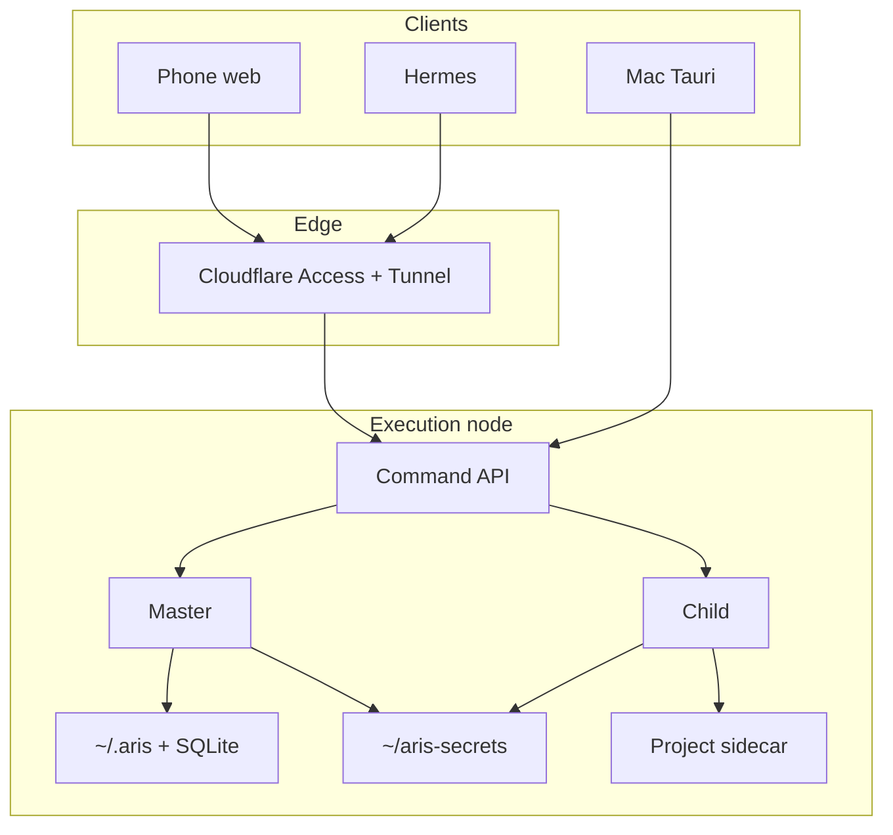

# Architecture

## Monorepo

```
aris-as-your-agent/
├── docs/                 Product docs, progress, ADRs
├── apps/web              TanStack Start — Aris Studio UI
├── packages/
│   ├── core              Pipeline phases, types
│   ├── agent             Provider router (Cursor SDK + OpenRouter lite)
│   ├── workspace         ~/.aris home, settings, sessions
│   ├── projects          Folder-backed project registry
│   ├── tasks             Board / task graph (sidecar tasks.json)
│   ├── stream            SDK → UI stream events
│   ├── research          Research phase helpers
│   ├── notes             Private vs agent notes
│   └── server            SSH registry + backup gate
└── .cursor/              composer-rules + Aris persona
```

## Runtime boundary

- **Client:** React UI only. No provider SDKs, no secrets.
- **Server:** TanStack Start server functions + `/api/agent` SSE. Provider adapters run here; Cursor uses `local: { cwd: project.workspacePath }`.

## Agent / SSE flow

```
UI (Board or Chat)
  → POST /api/agent { projectId, message, taskId?, phase? }
  → resolve active account (provider + apiKey)
  → @aris/agent provider router
       ├─ cursor → Agent.resume | Agent.create (full harness)
       └─ openrouter → AI SDK streamText (lite harness)
  → onDelta / stream → SSE events
  → UI Store / AI Elements
```

Multi-provider accounts: [ADR 014](./decisions/014-multi-harness-providers.md).

## Storage map

| Data | Path |
|------|------|
| App settings / accounts | `~/.aris/settings.json` |
| Project registry | `~/.aris/projects.json` |
| Notes | `~/.aris/notes.json` |
| Servers metadata | `~/.aris/servers.json` |
| SSH secrets | `~/aris-secrets/servers/*` (legacy: `~/.aris/secrets/servers/*`) |
| Default new projects | `~/aris-workspace/{slug}/` |
| Per-project sidecar | `{workspace}/.aris-workspace/` (`aris.json`, `tasks.json`, `chat.jsonl`) |
| Spec artifacts | `{workspace}/specs/active/` |

## Package seams

Prefer extending existing `@aris/*` APIs over new parallel packages. UI is a thin adapter over server functions.

## Native shell (planned)

**Next packaging step: Tauri** on macOS — wrap `apps/web`, keep `@aris/*` as local backend. See [ADR 005](./decisions/005-tauri-native-shell.md). Not started until Master chat / core loop land.

## Memory ranking (planned)

**On-device only:** SQLite FTS5 BM25 + logic weights (scope, type, recency, proof, pin). No external LLM re-ranker. Optional later: local embeddings + RRF. See [ADR 006](./decisions/006-local-memory-ranking.md). Codebase search stays with Cursor indexing.

## MCP registry (planned)

Studio-owned MCP list: **manual UI**, **Master tool-add**, **login** (API key or Aris-owned OAuth). Pass resolved `mcpServers` on every `Agent.create`/`resume`. Do not rely on Cursor IDE OAuth token store for local SDK. See [ADR 007](./decisions/007-mcp-registry.md).

## Topology (planned)

**Master** (control) vs **Child** (per-project execution). Clients: Mac Tauri, mobile web; Hermes/WhatsApp commands **Master and project/Child** via Command API. Later: Win11 **workstation node** holds folders + agent cwd; Mac/phone are clients. See [ADR 008](./decisions/008-master-child-hermes-workstation.md).

## Security (planned)

**Studio unlock** (password / biometric) + **Command API** device pairing and capability tokens before Hermes or remote clients. Secrets stay on the node; encrypt at rest after unlock. See [ADR 010](./decisions/010-studio-unlock-and-command-auth.md).

## Always-on node (planned)

Execution node (single local or workstation) can run as a **daemon** so Command API / Hermes work when the UI is closed. Opt-in stay-awake; no unauthenticated LAN. See [ADR 011](./decisions/011-always-on-node.md).

## Remote access (planned)

Away-from-desk / **phone** control via **Cloudflare Zero Trust + Tunnel** at a hostname like `https://agent.madebyaris.com` — outer Access gate, inner Aris unlock/Command auth; node stays local. See [ADR 012](./decisions/012-cloudflare-zero-trust-remote.md).

## Data & history (planned)

**Node-local source of truth** (decentralized): each execution node owns DB/history; no required central cloud DB. Project sidecar travels with the folder; secrets never sync. Optional non-secret sync later. See [ADR 013](./decisions/013-node-local-data.md).

## Multi-harness providers

**Cursor** remains the full local agent harness. **OpenRouter** is a second account provider for model choice / cost — chat/stream first, weaker than Cursor, improvable later. See [ADR 014](./decisions/014-multi-harness-providers.md).


